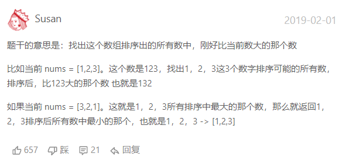

# 下一个排列
## 问题重述
实现获取 下一个排列 的函数，算法需要将给定数字序列重新排列成字典序中下一个更大的排列。

如果不存在下一个更大的排列，则将数字重新排列成最小的排列（即升序排列）。

必须 原地 修改，只允许使用额外常数空间。

链接：https://leetcode-cn.com/problems/next-permutation

*话说这种话真的有人能够看懂吗emmm*

*hhhhhhhhhhhhhhhhhhh*


**下面是人话版本**


*hhh终于看懂了。。。*

## 问题分析
    想要找到比输入数组更大的一个的组合排列，可以直观的想到应当从最小的位数开始，即从最小的两位开始比较，如果高位的数值比低位数值小，那么两位数的位置互换即可得到结果。
    顺着这个思路来进行分析，假如后两位数中有
    $nums[n-1]>=nums[n]$
    那么我们需要对nums[n-2]位进行考虑，因为nums[n-2]之后的数据是从大到小排列的，因此只需要从低位到高位来对其间大小来进行比较，发现合适的就进行换位操作。
    同时我们发现换位后的后部分是从大到小来进行排序的，因此对其进行倒序操作即可获得最小情况。（注意倒序方法）
    多位数的方法也是一样的。

    时间复杂度分析：外层一个循环 内层一个循环 一个倒序操作
    $T(n) = O(n^3)$

## 代码展示
```c++
// 获取下一个最大排列
// 基本思路： 从小位向高位 外部一个n-1循环 内部一个循环 反序函数 是否找到的判断标志位
#include <cstdio>
#include <iostream>
#include <vector>
using namespace std;
class Solution {
public:
    void nextPermutation(vector<int>& nums) {
        iffound = false; 
        num = nums.size();
        for(int i = num-2;i>=0;i--)
        {
            for(int j = num-1;j>i;j--)
            {
                if(nums[j] > nums[i])
                {
                    tempValue = nums[j];
                    nums[j] = nums[i];
                    nums[i] = tempValue;
                    iffound = !iffound;
                    revSort(nums, i+1);
                    break;
                }
            }
            if(iffound) break;
        }
        if(iffound) {/*outputResult(nums);*/return ;}
        else {revSort(nums, 0); /*outputResult(nums);*/return ;}
    }
    void revSort(vector<int> &nums,int begin)
    {
        int time = (num - begin)/2;
        for(int i = 0;i<time;i++)
        {
            tempValue = nums[begin + i];
            nums[begin + i] = nums[num-1-i];
            nums[num-i-1] = tempValue;
        }
    }
    void outputResult(vector<int> & nums)
    {
        cout<<"[";
        cout<<nums[0];
        for(int i = 1;i < num; i++)
        {
            cout<<","<<nums[i];
        }
        cout<<"]";
    }
private:
    bool iffound;
    int num;
    int tempValue;
};

int main(void)
{
    Solution A;
    vector<int> L = {2,1};
    A.nextPermutation(L);
    return 0;
}
```